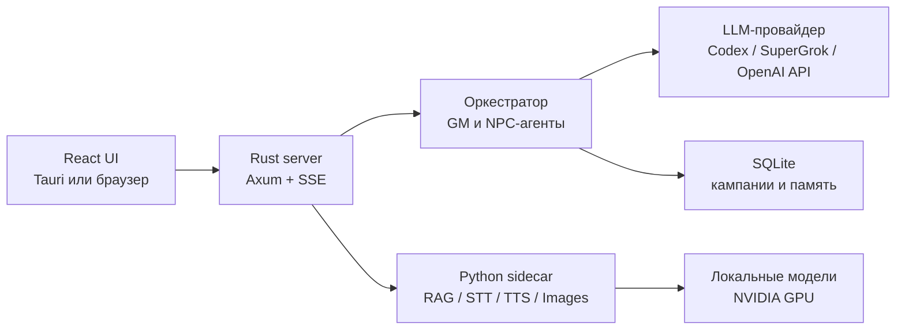

# TaleShift

TaleShift — настольное приложение для ролевых игр с ИИ-ведущим. Ведущий описывает мир, разыгрывает сцены и вызывает отдельных ИИ-персонажей, а приложение хранит историю, состояние героев и память мира между ходами.

Проект можно использовать как готовое desktop-приложение или запустить в серверном режиме и открыть в браузере. Основная языковая модель подключается отдельно: через Codex OAuth, SuperGrok OAuth или OpenAI-совместимый API.

Текущая версия — `0.1.0`. Проект активно развивается и пока ориентирован на Windows.

## Что умеет TaleShift

- вести сюжет и диалоги в потоковом режиме;
- отменять и повторять ходы;
- разыгрывать NPC как отдельных агентов со своими характерами и памятью;
- хранить сцены, факты, слухи, персонажей и историю в локальной SQLite-базе;
- вести состояние героев, перемещения и броски кубиков;
- создавать собственные миры, истории и персонажей во встроенных студиях;
- хранить их в библиотеке, искать, импортировать и экспортировать пакеты;
- искать релевантные факты мира через локальный RAG;
- озвучивать ответы локальной TTS-моделью;
- распознавать голос локально многоязычной Whisper-моделью или через поддерживаемый облачный коннектор;
- создавать иллюстрации локально через ComfyUI и FLUX.2;
- переключать русский и английский интерфейс;
- работать как desktop-приложение или headless-сервер;
- подключаться к Codex, SuperGrok и OpenAI-совместимым сервисам.

Локальные модели необязательны. Можно установить только приложение и использовать внешний LLM-провайдер.

## Поддерживаемая конфигурация

Готовый установщик сейчас рассчитан на **Windows 10/11 x64**. Для desktop-режима нужен WebView2, который обычно уже установлен вместе с Microsoft Edge.

Для сборки потребуются:

- Git;
- Node.js 20.19+ или 22.12+;
- Rust 1.92 через rustup (версия закреплена в репозитории; код требует минимум 1.85);
- Visual Studio Build Tools 2022 с компонентом **Desktop development with C++**.
- Windows 10/11 SDK, выбранный в Visual Studio Installer.

Для локальных RAG и TTS нужна NVIDIA Ampere или новее (RTX 30+, compute capability 8+) с поддержкой BF16 и актуальным драйвером. Локальный STT работает на CPU или NVIDIA GPU, но входит в профиль `Voice`, которому GPU нужен также для TTS. Профили `Images` и `Full` используют NVFP4 и поддерживаются только на Blackwell: GeForce RTX 50 или совместимая карта с compute capability 10 и выше. Полный стек проверен на RTX 5090 с 32 ГБ VRAM; минимальный поддерживаемый объём VRAM пока не установлен. Для `Full` зарезервируйте около 36 ГБ свободного места.

Код проекта остаётся кроссплатформенным, но бесшовная установка на macOS и Linux пока не подготовлена и не считается поддерживаемым сценарием.

## Быстрая установка

```powershell
git clone https://github.com/IGRINI/TaleShift.git
cd TaleShift
.\setup.cmd
.\run.cmd
```

Установщик проверит системные зависимости, предложит профиль, подготовит Python-окружения, скачает выбранные модели и соберёт приложение. Отдельно устанавливать Python не нужно. Безопасный профиль по умолчанию — `Minimal`.

Если PowerShell запрещает запуск локальных сценариев:

```powershell
powershell -NoProfile -ExecutionPolicy Bypass -File .\setup.ps1
powershell -NoProfile -ExecutionPolicy Bypass -File .\run.ps1
```

Для интерактивной установки также можно дважды нажать `setup.cmd`.

## Профили установки

Все расширенные профили включают `Rag`. `Voice` и `Images` добавляют разные возможности, а `Full` объединяет их.

| Профиль | Что устанавливается | Для кого |
| --- | --- | --- |
| `Minimal` | Только приложение, без локальных моделей | Нужны внешний LLM и минимальный размер установки |
| `Rag` | `Minimal` + Qwen3 Embedding + Jina Reranker | Нужна локальная память мира и поиск фактов |
| `Voice` | `Rag` + Whisper Small STT + Qwen3 TTS | Нужны RAG, локальный голосовой ввод и озвучка |
| `Images` | `Rag` + ComfyUI + FLUX.2 Klein NVFP4 | Нужны RAG и локальные иллюстрации на RTX 50 |
| `Full` | `Rag` + STT + TTS + генерация изображений | Все локальные возможности |

Профили управляют только локальными моделями. В `Minimal`, `Rag` и `Voice` облачная генерация изображений остаётся доступной через SuperGrok. `Rag`, `Voice`, `Images` и `Full` включают Jina Reranker под CC BY-NC 4.0 и предназначены только для некоммерческого использования. Image-профили дополнительно содержат файлы с неподтверждёнными правами и считаются экспериментальными.

Профиль можно выбрать сразу:

```powershell
.\setup.cmd -Profile Full
```

Загрузки можно безопасно продолжить после обрыва. Установщик использует закреплённые версии моделей и проверяет скачанные файлы.

### Hugging Face token

Все текущие модели доступны публично, поэтому Hugging Face token необязателен. Установщик позволяет ввести его для gated-репозиториев и ограничений загрузки. Достаточно fine-grained token с правом чтения. Он используется только во время установки и не записывается в `.env` или настройки приложения.

Для неинтерактивной установки token можно передать только в текущий процесс PowerShell:

```powershell
$env:HF_TOKEN = "hf_..."
.\setup.cmd -Profile Full -NonInteractive -AcceptRestrictedModelLicenses
Remove-Item Env:HF_TOKEN
```

Перед скачиванием закрытых или ограниченных моделей нужно отдельно принять их условия на Hugging Face.

### Дополнительные параметры

| Параметр | Назначение |
| --- | --- |
| `-InferenceHome <путь>` | Хранить окружения и модели в другой папке |
| `-SkipBuild` | Подготовить зависимости и модели, оставив установку незавершённой до следующего запуска без этого флага |
| `-VerifyOnly` | Проверить модели, конфигурацию, Python lock-окружения и соответствие release build текущим исходникам без скачивания и сборки |
| `-NonInteractive` | Не задавать вопросы; все обязательные значения должны быть переданы заранее |
| `-AcceptRestrictedModelLicenses` | Явно принять условия моделей с ограниченной или неподтверждённой лицензией |

Пример установки моделей на другой диск:

```powershell
.\setup.cmd -Profile Full -InferenceHome "D:\TaleShift\inference"
```

По умолчанию локальный inference хранится в `%LOCALAPPDATA%\gm-lab\inference` и не попадает в Git. Имя внутреннего каталога `gm-lab` сохранено для совместимости с существующими установками.

`run.cmd` запускает только завершённую сборку, которая соответствует текущим исходникам. После `git pull` или `-SkipBuild` сначала снова выполните `setup.cmd`.

## Первый запуск

Запустите приложение:

```powershell
.\run.cmd
```

Затем:

1. Откройте настройки подключения.
2. Выберите Codex, SuperGrok или OpenAI-совместимый провайдер.
3. Пройдите OAuth-авторизацию либо укажите адрес сервера, модель и API key.
4. Создайте или загрузите историю и начните игру.

Hugging Face token нужен только установщику. Для самой игры требуется отдельная авторизация у выбранного LLM-провайдера.

### Серверный режим

```powershell
.\run.cmd -Server
```

После запуска интерфейс доступен по адресу `http://127.0.0.1:8000`.

Встроенный server mode предназначен только для localhost и отклоняет внешний `GM_HOST`. У него нет собственной входной аутентификации. Для удалённого доступа оставьте TaleShift на loopback и используйте отдельно настроенный reverse proxy с TLS, аутентификацией и ограничением доступа.

## Важные ограничения

- Локальный многоязычный STT устанавливается профилями `Voice` и `Full`. Если он не установлен или отключён, голосовой ввод сохраняет fallback на выбранный коннектор с поддержкой транскрибации.
- Профили `Images` и `Full` рассчитаны только на Blackwell/RTX 50 из-за текущей NVFP4-модели.
- Первый запуск локального inference может занять несколько минут: модели загружаются в память и прогреваются.
- При нехватке VRAM используйте более лёгкий профиль или отключите TTS/изображения в настройках.
- Приложение не делает LLM локальным автоматически: `Minimal` всё равно требует внешний провайдер, а остальные профили добавляют только RAG, речь и изображения.

## Где хранятся данные

На Windows пользовательские настройки, кампании, библиотека и кэши находятся в каталогах приложения внутри `%APPDATA%\gm-lab`. Модели и Python-окружения по умолчанию находятся в `%LOCALAPPDATA%\gm-lab\inference`.

Диалоги и библиотека остаются на компьютере. Текст запросов к облачной LLM передаётся выбранному провайдеру согласно его условиям и политике конфиденциальности.

Модели не входят в репозиторий и не собираются в исполняемый файл. Это позволяет обновлять код без повторного скачивания десятков гигабайт данных.

Лог локального inference:

```text
%LOCALAPPDATA%\gm-lab\inference\logs\sidecar.log
```

## Как устроен проект



Основной backend написан на Rust. Интерфейс — React/Vite. Один Python sidecar поднимает локальные embedding, reranking, STT, TTS и image endpoints на `127.0.0.1:8077`; приложение запускает и останавливает его автоматически. Браузерное WebM/WAV-аудио декодируется встроенным в Python wheel PyAV, поэтому системный ffmpeg для STT не нужен.

Главные каталоги репозитория:

| Каталог | Содержимое |
| --- | --- |
| `crates/` | Rust backend, оркестратор, коннекторы, хранение данных и desktop-приложение |
| `web/` | React-интерфейс |
| `sidecar/` | Локальный inference и манифест моделей |
| `tests/` | Эталонные сценарии и интеграционные проверки |
| `docs/` | Архитектурные заметки |

Расширенную настройку можно выполнить через `.env`; доступные параметры и безопасные примеры перечислены в [`.env.example`](.env.example). Не добавляйте рабочий `.env`, API keys и OAuth-данные в Git.

## Обновление

```powershell
git pull
.\setup.cmd -Profile Minimal
```

Вместо `Minimal` укажите тот же профиль, который использовали при первой установке. Уже скачанные корректные файлы будут переиспользованы.

## Разработка

После выполнения `setup.ps1` проект можно запускать напрямую:

```powershell
cargo run -p gml-app
cargo run -p gml-app -- --server
```

Проверки проекта:

```powershell
cargo test --workspace --locked
cd web
npm test
npm run build
```

Сборка релизного desktop-приложения:

```powershell
cd web
npm ci
npm run build
cd ..
cargo build -p gml-app --release --locked
```

## Решение проблем

**Установщик сообщает об отсутствующей зависимости.** Установите указанную программу, откройте новый PowerShell и повторите `setup.cmd`. Сценарий рассчитан на повторный запуск.

**Загрузка модели оборвалась.** Запустите ту же команду ещё раз. Hugging Face продолжит загрузку, а готовые файлы будут проверены и пропущены.

**Локальные функции долго запускаются или недоступны.** Проверьте актуальность NVIDIA-драйвера и `%LOCALAPPDATA%\gm-lab\inference\logs\sidecar.log`, затем выполните:

```powershell
.\setup.cmd -Profile Full -VerifyOnly
```

Вместо `Full` укажите свой профиль.

**Порт занят.** Сервер использует `8000`, локальный inference — `8077`, ComfyUI — `8188`. Завершите старый процесс TaleShift или задайте другой порт через соответствующую переменную окружения.

## Лицензии

Код TaleShift распространяется по [Apache License 2.0](LICENSE). Сведения об авторстве находятся в [`NOTICE`](NOTICE), а сторонние лицензии — в [`THIRD_PARTY_NOTICES.md`](THIRD_PARTY_NOTICES.md).

Модели скачиваются напрямую от их авторов и имеют собственные условия:

- Qwen3 Embedding, OpenAI Whisper Small и Qwen3 TTS — Apache 2.0;
- FLUX.2 Klein 4B NVFP4 — Apache 2.0;
- Jina Reranker v3 — CC BY-NC 4.0, коммерческое использование запрещено; это ограничение затрагивает все профили, кроме `Minimal`;
- эталонные записи голосов взяты из MIT-репозитория `faster-qwen3-tts`, но права на сами голоса отдельно не описаны;
- часть файлов image-пайплайна публикуется с неподтверждённой лицензией и требует осознанного принятия условий перед установкой.

Лицензия репозитория не заменяет лицензии моделей. Перед распространением, публичным сервисом или коммерческим использованием проверьте условия каждого стороннего компонента.

Закреплённые источники, ревизии и контрольные суммы перечислены в [`sidecar/models.json`](sidecar/models.json).
