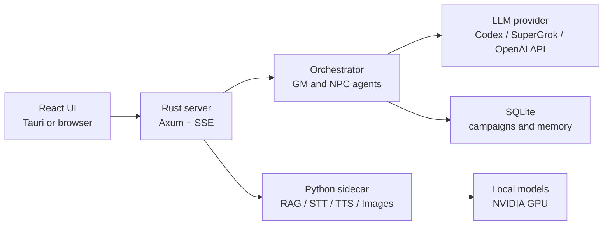

# TaleShift

English | [Русский](README.ru.md)

TaleShift is a desktop application for role-playing games with an AI game master. The game master describes the world, plays out scenes, and invokes dedicated AI characters, while the application preserves the story, character state, and world memory between turns.

You can use the project as a ready-to-run desktop application or start it in server mode and open it in a browser. The primary language model is connected separately through Codex OAuth, SuperGrok OAuth, or an OpenAI-compatible API.

The current version is `0.1.0`. The project is under active development and currently targets Windows.

## What TaleShift can do

- stream narrative and dialogue;
- undo and retry turns;
- play NPCs as dedicated agents with their own personalities and memories;
- store scenes, facts, rumors, characters, and history in a local SQLite database;
- track character state and movement, and handle dice rolls;
- create custom worlds, stories, and characters in the built-in studios;
- keep them in a searchable library, and import or export packages;
- retrieve relevant world facts through local RAG;
- read responses aloud with a local TTS model;
- transcribe speech locally with a multilingual Whisper model or through a supported cloud connector;
- create illustrations locally with ComfyUI and FLUX.2;
- switch between English and Russian interfaces;
- run as a desktop application or a headless server;
- connect to Codex, SuperGrok, and OpenAI-compatible services.

Local models are optional. You can install only the application and use an external LLM provider.

## Supported configuration

The ready-to-use installer currently supports **Windows 10/11 x64**. Desktop mode requires WebView2, which is normally installed with Microsoft Edge.

Building the project requires:

- Git;
- Node.js 20.19+ or 22.12+;
- Rust 1.92 through rustup (the repository pins this version; the code requires at least 1.85);
- Visual Studio Build Tools 2022 with the **Desktop development with C++** workload;
- a Windows 10/11 SDK selected in Visual Studio Installer.

Local RAG and TTS require an NVIDIA Ampere GPU or newer (RTX 30+, compute capability 8+) with BF16 support and a current driver. Local STT runs on either a CPU or an NVIDIA GPU, but it is part of the `Voice` profile, which also requires a GPU for TTS. The `Images` and `Full` profiles use NVFP4 and are supported only on Blackwell: a GeForce RTX 50 or compatible GPU with compute capability 10 or higher. The full stack has been tested on an RTX 5090 with 32 GB of VRAM; the minimum supported VRAM capacity has not yet been established. Reserve about 36 GB of free disk space for `Full`.

The codebase remains cross-platform, but seamless installation on macOS and Linux is not ready and is not considered a supported scenario yet.

## Quick installation

```powershell
git clone https://github.com/IGRINI/TaleShift.git
cd TaleShift
.\setup.cmd
.\run.cmd
```

The installer checks system dependencies, asks you to choose a profile, prepares the Python environments, downloads the selected models, and builds the application. You do not need to install Python separately. The safe default profile is `Minimal`.

If PowerShell blocks local scripts:

```powershell
powershell -NoProfile -ExecutionPolicy Bypass -File .\setup.ps1
powershell -NoProfile -ExecutionPolicy Bypass -File .\run.ps1
```

For an interactive installation, you can also double-click `setup.cmd`.

## Installation profiles

Every extended profile includes `Rag`. `Voice` and `Images` add different capabilities, while `Full` combines them.

| Profile | Installed components | Best for |
| --- | --- | --- |
| `Minimal` | Application only, without local models | External LLM usage and the smallest installation |
| `Rag` | `Minimal` + Qwen3 Embedding + Jina Reranker | Local world memory and fact retrieval |
| `Voice` | `Rag` + Whisper Small STT + Qwen3 TTS | RAG, local voice input, and speech synthesis |
| `Images` | `Rag` + ComfyUI + FLUX.2 Klein NVFP4 | RAG and local illustrations on an RTX 50 |
| `Full` | `Rag` + STT + TTS + image generation | Every local capability |

Profiles control only local models. Cloud image generation through SuperGrok remains available with `Minimal`, `Rag`, and `Voice`. `Rag`, `Voice`, `Images`, and `Full` include Jina Reranker under CC BY-NC 4.0 and are intended only for non-commercial use. Image profiles also contain files with unverified licensing and are considered experimental.

You can select a profile directly:

```powershell
.\setup.cmd -Profile Full
```

Interrupted downloads can be resumed safely. The installer uses pinned model versions and verifies downloaded files.

### Hugging Face token

All current models are publicly available, so a Hugging Face token is optional. The installer lets you provide one for gated repositories and download rate limits. A fine-grained token with read access is sufficient. It is used only during installation and is never written to `.env` or the application settings.

For a non-interactive installation, pass the token only to the current PowerShell process:

```powershell
$env:HF_TOKEN = "hf_..."
.\setup.cmd -Profile Full -NonInteractive -AcceptRestrictedModelLicenses
Remove-Item Env:HF_TOKEN
```

Before downloading private or restricted models, you must separately accept their terms on Hugging Face.

### Additional options

| Option | Purpose |
| --- | --- |
| `-InferenceHome <path>` | Store environments and models in another directory |
| `-SkipBuild` | Prepare dependencies and models, leaving the installation incomplete until the next run without this flag |
| `-VerifyOnly` | Verify models, configuration, locked Python environments, and whether the release build matches the current sources, without downloading or building |
| `-NonInteractive` | Do not ask questions; all required values must be provided in advance |
| `-AcceptRestrictedModelLicenses` | Explicitly accept the terms of models with restricted or unverified licenses |

Example: install models on another drive:

```powershell
.\setup.cmd -Profile Full -InferenceHome "D:\TaleShift\inference"
```

By default, local inference is stored in `%LOCALAPPDATA%\gm-lab\inference` and is not added to Git. The internal directory name `gm-lab` is preserved for compatibility with existing installations.

`run.cmd` starts only a completed build that matches the current sources. After `git pull` or `-SkipBuild`, run `setup.cmd` again first.

## First run

Start the application:

```powershell
.\run.cmd
```

Then:

1. Open the connection settings.
2. Choose Codex, SuperGrok, or an OpenAI-compatible provider.
3. Complete OAuth authorization, or enter the server address, model, and API key.
4. Create or load a story and start playing.

The Hugging Face token is needed only by the installer. Playing requires separate authorization with your chosen LLM provider.

### Server mode

```powershell
.\run.cmd -Server
```

After startup, the interface is available at `http://127.0.0.1:8000`.

The built-in server mode is intended only for localhost and rejects an external `GM_HOST`. It does not provide its own inbound authentication. For remote access, keep TaleShift bound to loopback and use a separately configured reverse proxy with TLS, authentication, and access restrictions.

## Important limitations

- Local multilingual STT is installed by the `Voice` and `Full` profiles. If it is not installed or is disabled, voice input retains a fallback to the selected connector when that connector supports transcription.
- The `Images` and `Full` profiles require Blackwell/RTX 50 because of the current NVFP4 model.
- The first startup of local inference can take several minutes while models are loaded into memory and warmed up.
- If VRAM is insufficient, use a lighter profile or disable TTS and image generation in the settings.
- The application does not automatically make the LLM local: `Minimal` still requires an external provider, while the other profiles add only RAG, speech, and images.

## Data locations

On Windows, user settings, campaigns, the library, and caches are stored in the application directories under `%APPDATA%\gm-lab`. Models and Python environments are stored in `%LOCALAPPDATA%\gm-lab\inference` by default.

Conversations and the library remain on your computer. Prompt text sent to a cloud LLM is handled by the selected provider under its terms and privacy policy.

Models are not included in the repository or bundled into the executable. This allows the code to be updated without downloading tens of gigabytes again.

Local inference log:

```text
%LOCALAPPDATA%\gm-lab\inference\logs\sidecar.log
```

## Architecture



The main backend is written in Rust. The interface uses React and Vite. A single Python sidecar exposes local embedding, reranking, STT, TTS, and image endpoints on `127.0.0.1:8077`; the application starts and stops it automatically. Browser-produced WebM/WAV audio is decoded by the PyAV wheel bundled with Python, so STT does not require a system installation of ffmpeg.

Main repository directories:

| Directory | Contents |
| --- | --- |
| `crates/` | Rust backend, orchestrator, connectors, data storage, and desktop application |
| `web/` | React interface |
| `sidecar/` | Local inference and the model manifest |
| `tests/` | Reference scenarios and integration checks |
| `docs/` | Architecture notes |

Advanced configuration is available through `.env`; supported options and safe examples are listed in [`.env.example`](.env.example). Do not commit a working `.env`, API keys, or OAuth credentials to Git.

## Updating

```powershell
git pull
.\setup.cmd -Profile Minimal
```

Replace `Minimal` with the profile you used during the initial installation. Existing valid downloads will be reused.

## Development

After running `setup.ps1`, you can start the project directly:

```powershell
cargo run -p gml-app
cargo run -p gml-app -- --server
```

Project checks:

```powershell
cargo test --workspace --locked
cd web
npm test
npm run build
```

Build the release desktop application:

```powershell
cd web
npm ci
npm run build
cd ..
cargo build -p gml-app --release --locked
```

## Troubleshooting

**The installer reports a missing dependency.** Install the named program, open a new PowerShell window, and run `setup.cmd` again. The script is designed to be rerun safely.

**A model download was interrupted.** Run the same command again. Hugging Face will resume the download, while completed files will be verified and skipped.

**Local features take a long time to start or are unavailable.** Check that the NVIDIA driver is current and inspect `%LOCALAPPDATA%\gm-lab\inference\logs\sidecar.log`, then run:

```powershell
.\setup.cmd -Profile Full -VerifyOnly
```

Replace `Full` with your profile.

**A port is already in use.** The server uses `8000`, local inference uses `8077`, and ComfyUI uses `8188`. Stop the old TaleShift process or set another port through the corresponding environment variable.

## Licensing

TaleShift source code is distributed under the [Apache License 2.0](LICENSE). Attribution information is available in [`NOTICE`](NOTICE), and third-party licenses are listed in [`THIRD_PARTY_NOTICES.md`](THIRD_PARTY_NOTICES.md).

Models are downloaded directly from their authors and have their own terms:

- Qwen3 Embedding, OpenAI Whisper Small, and Qwen3 TTS: Apache 2.0;
- FLUX.2 Klein 4B NVFP4: Apache 2.0;
- Jina Reranker v3: CC BY-NC 4.0; commercial use is prohibited. This restriction affects every profile except `Minimal`;
- reference voice recordings come from the MIT-licensed `faster-qwen3-tts` repository, but the rights to the voices themselves are not documented separately;
- some image-pipeline files are published with unverified licensing and require informed acceptance of their terms before installation.

The repository license does not replace model licenses. Before distribution, operating a public service, or commercial use, review the terms of every third-party component.

Pinned sources, revisions, and checksums are listed in [`sidecar/models.json`](sidecar/models.json).
